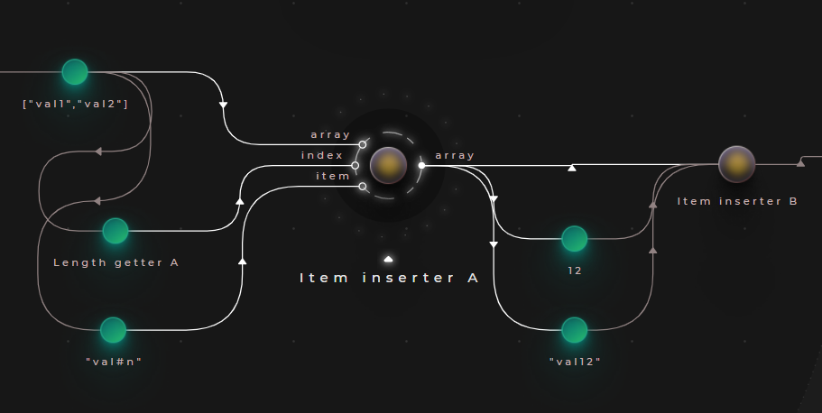
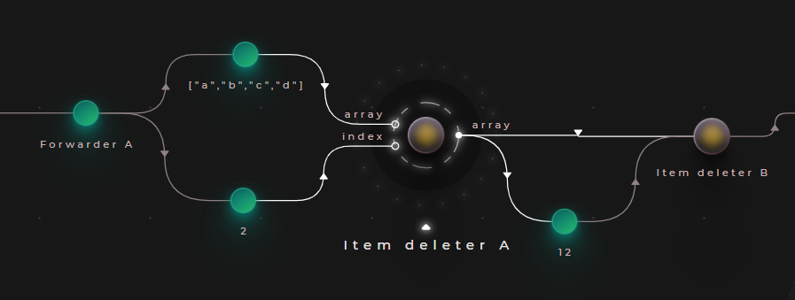

# Using setters & deleters

Setters are the atomic data manipulation operations in Cranq. There are built-in nodes for dictionaries/records, and one for arrays.

## Example - Adding/assigning items to dictionaries

> **_Try out:_**
>
> Place node **tutorials/data_constr/setter_dict** or **[download .cranqj](cranqj/data_constr_setter_dict.cranqj)** 

Adding/assigning items in a dictionary can be performed with the ```data/dictionary/Item setter``` node
- It takes a dictionary, and a key/value pair as input
- If the key already exists in it, the value will be overwritten
- If the key does not exist, it will be created


### Sample output:

```json
{
  "key2": "value2",
  "key1": "value1"
}
```

## Example - Inserting items into arrays

> **_Try out:_**
>
> Place node **tutorials/data_constr/setter_arr** or **[download .cranqj](cranqj/data_constr_setter_arr.cranqj)** 

Adding/assigning elements in arrays can be performed with the ```data/array/Item inserter``` node.
- It takes the target array, the item to add, and the index to insert at as input
- Over-indexing is possible, but items can only be added to the end of the array



### Sample output:

```json
[
  "val1",
  "val2",
  "val#n",
  "val12"
]
```

## Example - Deleting items from dictionaries

> **_Try out:_**
>
> Place node **tutorials/data_constr/deleter_dict** or **[download .cranqj](cranqj/data_constr_deleter_dict.cranqj)** 

Deleting items from dictionaries by key can be performed with the ```data/dictionary/Item deleter``` node.
- It takes the dictionary and the key to remove as arguments
- If the key does not exists, the node leaves the input unchanged


### Sample output:

```json
{
  "a": "b"
}
```

## Example - Deleting items from arrays

> **_Try out:_**
>
> Place node **tutorials/data_constr/deleter_arr** or **[download .cranqj](cranqj/data_constr_deleter_arr.cranqj)** 

Deleting items from arrays is possible by index, with the ```data/array/Item deleter``` node.
- It takes the array and the index to remove as arguments



### Sample output:

```json
[
  "a",
  "b",
  "d"
]
```