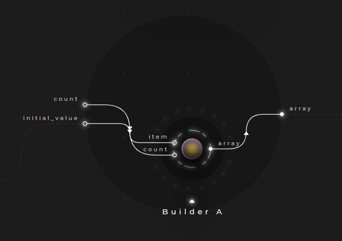
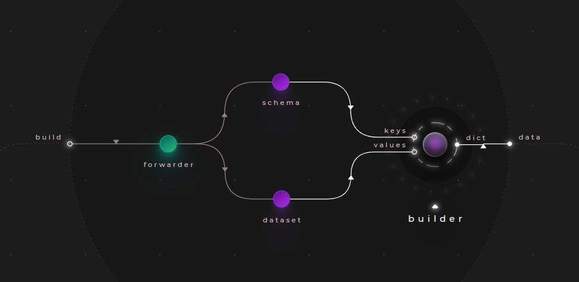

# Using builders

Cranq provides a set of builder nodes, allowing the construction/initialization of arrays and key-value based structures.

## Example - Initializing an empty array

> **_Try out:_**
>
> Place node **tutorials/data_constr/init_array** or **[download .cranqj](cranqj/data_constr_init_array.cranqj)** 

In this example, we use the ```data/array/Builder``` node to initialize an empty array. The initial values can be specified on it's ```item``` input port.



### Sample output:

```json
[
  null,
  null,
  null,
  null
]
```

## Example - Building a complex type

> **_Try out:_**
>
> Place node **tutorials/data_constr/init_complex_type** or **[download .cranqj](cranqj/data_constr_init_complex_type.cranqj)** 

In this example, we will build a simple entity, representing an employee. 
In Cranq, types complex types can currently be built as dictionaries.
To accomplish this, we will use the ```data/dictionary/Builder/keys & values``` node.



- This node builds key-value pairs, by taking the keys & values from the appropriate input, matching them by their order
- Both inputs must be arrays

In our example, we supply the following values:

```json
# keys:
["EmpID","Name","Dept","HireDate","Salary"]

# values:
[101,"Sue","Facilities","2019-02-13",1500]
```

### Sample output:

```json
{
  "EmpID": 101,
  "Name": "Sue",
  "Dept": "Accounting",
  "HireDate": "2019-02-13",
  "Salary": 1500
}
```
