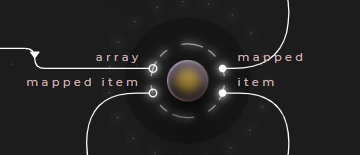
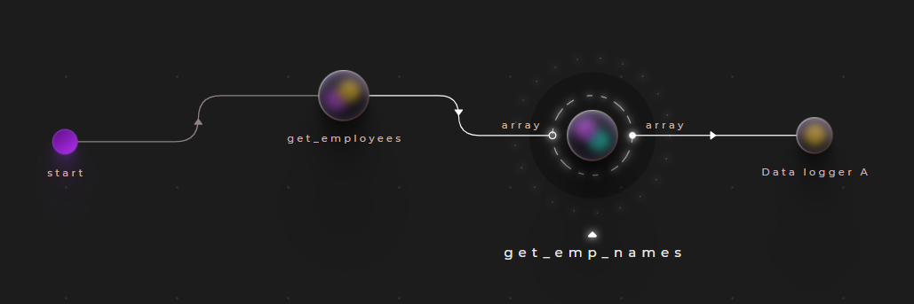
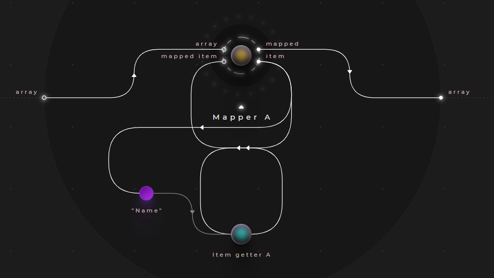
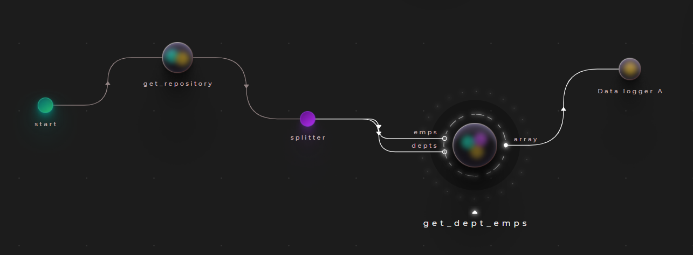
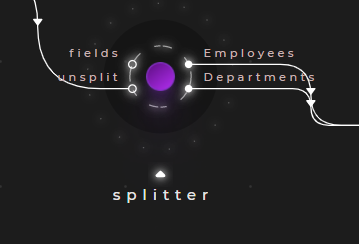
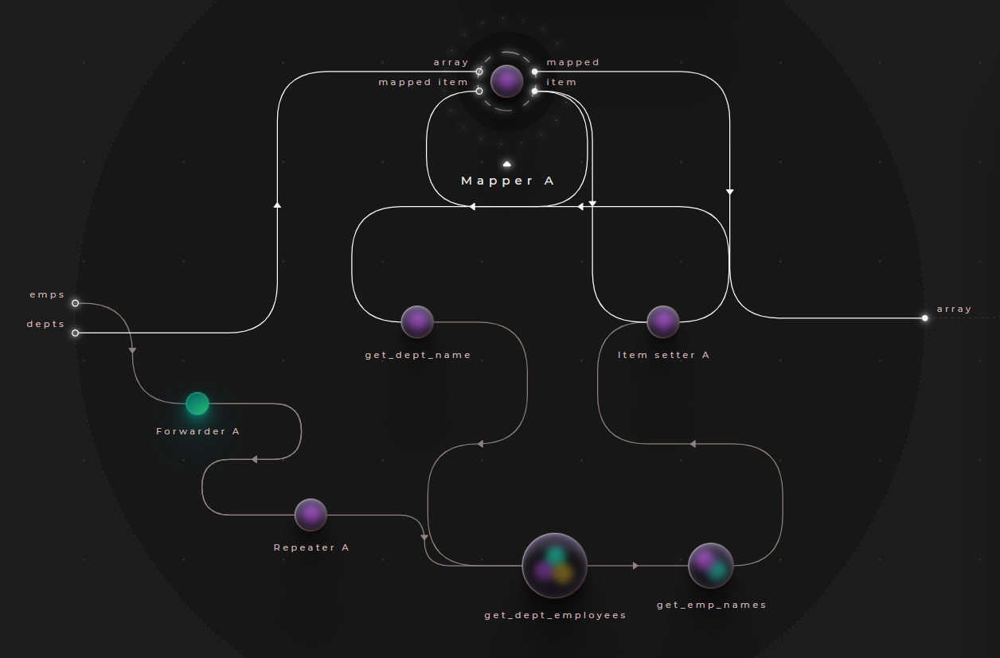
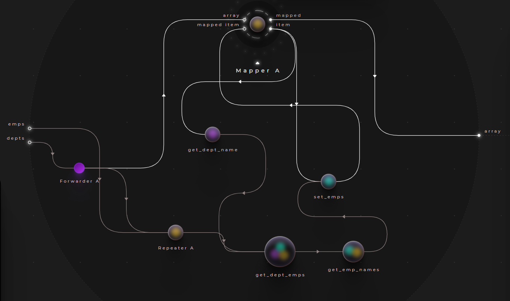

# Using mappers

Mappers can be used to map each element of an array to a value, typically calculated from the element itself. In Cranq, the ```data/array/Mapper``` node can be used for this purpose.



- The node takes an array as it's input
- It iterates through the array items, and yields each on it's ```item``` output
- The developer should perform the required transformations, and route it back to the ```mapped item``` input, with the same tag
- Once each element is accounted for in the ```mapped item``` input, the node yields the collected results on it's ```mapped``` output

> **_More info:_**
>
> For application flow use cases of mappers, check out  **[Application flow - Iterators / loops](../../1_application_flow/1_2_iterators/README.md)**

## Example - Selecting from collections of complex types

> **_Try out:_**
>
> Place node **tutorials/data_qry/get_emp_names** or **[download .cranqj](cranqj/data_qry_mapper_property_select.cranqj)** 

In **[Example - Concatenating arrays](../../2_constructing_data/2_3_merge_concat/README.md)**, we created an array of employee records - building on this dataset, let's implement a node, that outputs the employee names.

As a reminder, here is our test dataset:

### Test data:
```json
[
  {
    "EmpID": 101,
    "Name": "Sue",
    "Dept": "Facilities",
    "HireDate": "2019-02-13",
    "Salary": 1500
  },
  {
    "EmpID": 100,
    "Name": "Ted",
    "Dept": "Accounting",
    "HireDate": "2020-11-08",
    "Salary": 1500
  },
  {
    "EmpID": 1,
    "Name": "Joan",
    "Dept": "Accounting",
    "HireDate": "2016-04-28",
    "Salary": 2200
  },
  {
    "EmpID": 2,
    "Name": "Frank",
    "Dept": "Facilities",
    "HireDate": "2011-11-13",
    "Salary": 2000
  },
  {
    "EmpID": 3,
    "Name": "Louis",
    "Dept": "Legal",
    "HireDate": "2015-09-01",
    "Salary": 3000
  }
]
```



- Place an instance of the node ```tutorials/data_man/concat_array``` implemented in the previous example (or create it now)
- Create a node with a single input/output pair & connect it to the test data ```tutorials/data_man/concat_array``` - this will perform the mapping



- Drilling into the new node, place a ```data/array/Mapper``` node, and connect it to a ```data/dictionary/Item getter```
- We also need to specify which property do we want to select - this is done with a store in this example, but a static input value would also do fine

### Sample output

```json
[
  "Sue",
  "Ted",
  "Joan",
  "Frank",
  "Louis"
]
```

## Example - Left-joining collections

> **_Try out:_**
>
> Place node **tutorials/data_qry/mapper_emps_by_dept** or **[download .cranqj](cranqj/data_qry_mapper_join.cranqj)** 

In **[Example - Combining structures](../../2_constructing_data/2_4_syncer_splitter/README.md)**, we created a repository node, that builds a dataset with Employee and Department records.
Using this node, let's create one that joins employees to their departments, and outputs the result.

As a reminder, here is our test dataset:

### Test data:
```json
{
    "Departments": [
        {
          "Dept": "Accounting",
          "Head": "Joan"
        },
        {
          "Dept": "Facilities",
          "Head": "Frank"
        },
        {
          "Dept": "Legal",
          "Head": "Louis"
        }
    ],
    "Employees": [
        {
          "EmpID": 101,
          "Name": "Sue",
          "Dept": "Facilities",
          "HireDate": "2019-02-13",
          "Salary": 1500
        },
        {
          "EmpID": 100,
          "Name": "Ted",
          "Dept": "Accounting",
          "HireDate": "2020-11-08",
          "Salary": 1500
        },
        {
          "EmpID": 1,
          "Name": "Joan",
          "Dept": "Accounting",
          "HireDate": "2016-04-28",
          "Salary": 2200
        },
        {
          "EmpID": 2,
          "Name": "Frank",
          "Dept": "Facilities",
          "HireDate": "2011-11-13",
          "Salary": 2000
        },
        {
          "EmpID": 3,
          "Name": "Louis",
          "Dept": "Legal",
          "HireDate": "2015-09-01",
          "Salary": 3000
        }
    ]
}
```




- Place an instance of node ```tutorials/data_constr/syncer_repository```, and connect it to a ```flow/Splitter```
  
   
  - The splitter will split the data to Employee and Department collections - to do this, assign the static value ```["Employees","Departments"]``` to it's ```fields``` input
- Create a node with a single output, an input for ```emps``` and ```depts```, then connect it to the outputs of the ```flow/Splitter```




- Drilling into our new node, place a ```data/array/Mapper```, and wire it to the ```depts``` input. This node will map each department to a result calculated below.



- The mapper will enumerate the department list - first, we need to acquire the department name with a ```dictionary/Item getter``` node. Set the ```key``` input to a static value of ```Dept```
- Connect the calculated department name into an instance of node ```tutorials/data_qry/get_emps_by_dept``` , that is created in **[Example - Filtering an array](../3_2_filters/README.md)**. This node filters a list of employees by department


- We also need to connect the employee list to this node - however, as the mapper is an enumeration node, the ```emps``` input of the outer node can't be connected directly
  - Instead, we have to route it through a ```data/array/Repeater``` node
  - Connect the ```emps``` input to it's ```data``` input, and ```depts``` to ```array```

> **_More info:_**
>
> For more information about using the enumeration nodes with parameters & the usage of the repeater, check out  **[Example - Using parameters with iterators](../../1_application_flow/1_3_synchronization/README.md)**


- At this point, we have a list of employees for the department under iteration - we can now use the node from the previous example, ```tutorials/data_qry/get_emp_names``` to extract their names
- Then a ```dictionary/Item setter``` to merge the list of names into the deparment entry emitted from the mapper
  - Connect the name list to it's ```value``` input, and the ```item``` output of the mapper to ```dict```
  - Connect the ```dict``` output back to the mapper's ```mapped item``` input, concluding our iteration
- Finally, the ```mapped``` output of the mapper can be wired to out node output


### Sample output

```json
[
  {
    "Dept": "Accounting",
    "Head": "Joan",
    "Emps": [
      "Ted",
      "Joan"
    ]
  },
  {
    "Dept": "Facilities",
    "Head": "Frank",
    "Emps": [
      "Sue",
      "Frank"
    ]
  },
  {
    "Dept": "Legal",
    "Head": "Louis",
    "Emps": [
      "Louis"
    ]
  }
]
```